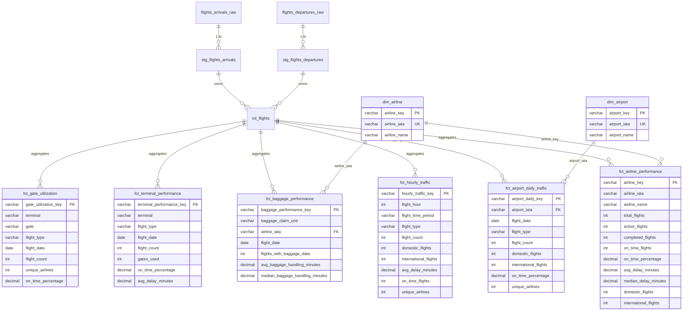
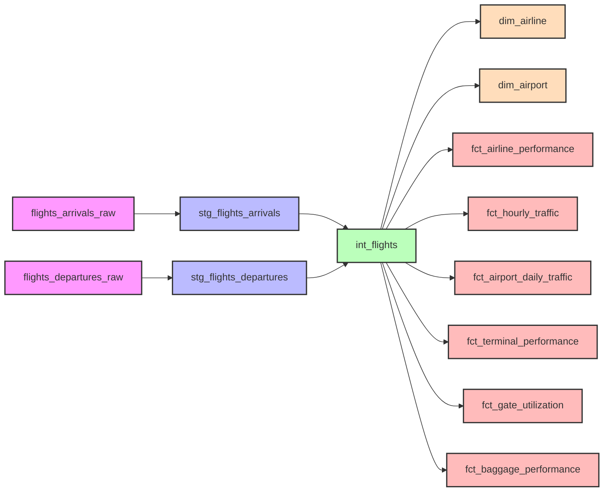

# Swedish Flight Data - Dimensional Model

## Data Model Overview

This dimensional model supports 6 key KPIs:
1. **Peak Hours** - Traffic patterns by time of day
2. **Punctuality** - On-time performance metrics
3. **Airline Performance** - Delay analysis by carrier
4. **Terminal Efficiency** - Terminal and gate utilization
5. **Gate Management** - Gate assignment optimization
6. **Baggage Handling** - Baggage delivery performance

---

## Entity Relationship Diagram

---

## Data Lineage

---

## Model Layers

### 📥 **Source Layer** (Raw Data)
- `flights_arrivals_raw` - Raw arrivals from Swedavia API
- `flights_departures_raw` - Raw departures from Swedavia API

### 🔄 **Staging Layer** (Cleaned & Standardized)
- `stg_flights_arrivals` - Flattened arrivals with calculated fields
- `stg_flights_departures` - Flattened departures with calculated fields

**Key Transformations:**
- Flatten nested JSON columns
- Rename columns for clarity
- Add calculated fields: `delay_minutes`, `is_on_time`, `is_domestic`
- Add flags: `is_deleted`, `is_cancelled`, `is_landed`
- Time dimensions: `arrival_hour`, `arrival_day_name`, `arrival_time_period`

### 🔀 **Intermediate Layer** (Unified Data)
- `int_flights` - Union of arrivals + departures with `flight_type` discriminator

### 📊 **Marts Layer** (Business Logic)

#### Dimensions
- `dim_airline` - Unique airlines (surrogate key)
- `dim_airport` - Swedish airports (ARN, GOT, MMX, etc.)

#### Facts
- `fct_airline_performance` - **KPI: Punctuality & Airline Performance**
  - Metrics: on-time %, avg delay, flight counts
  
- `fct_hourly_traffic` - **KPI: Peak Hours**
  - Metrics: flight counts by hour & time period
  
- `fct_airport_daily_traffic` - **KPI: Capacity Utilization**
  - Metrics: daily movements by airport
  
- `fct_terminal_performance` - **KPI: Terminal Efficiency**
  - Metrics: flights per terminal, gates used
  
- `fct_gate_utilization` - **KPI: Gate Management**
  - Metrics: flights per gate, airline diversity
  
- `fct_baggage_performance` - **KPI: Baggage Handling**
  - Metrics: avg/median baggage handling time

---

## KPI Mapping

| KPI | Fact Table | Key Metrics |
|-----|-----------|-------------|
| **Peak Hours** | `fct_hourly_traffic` | `flight_count`, `flight_time_period` |
| **Punctuality** | `fct_airline_performance` | `on_time_percentage`, `avg_delay_minutes` |
| **Airline Performance** | `fct_airline_performance` | `median_delay_minutes`, `on_time_flights` |
| **Terminal Efficiency** | `fct_terminal_performance` | `gates_used`, `on_time_percentage` |
| **Gate Management** | `fct_gate_utilization` | `flight_count`, `unique_airlines` |
| **Baggage Handling** | `fct_baggage_performance` | `avg_baggage_handling_minutes` |

---

## Data Quality

### Tests Implemented

Tests are defined in schema.yml files (generic tests):

**Staging Layer** (`models/staging/flights/schema.yml`):
- `not_null` on `flight_id`, `scheduled_arrival_utc`, `flight_status`
- `accepted_values` on `destination_airport_iata` (Swedish airports)
- `accepted_values` on `flight_status` (SCH, LAN, DEL, CAN, etc.)

**Intermediate Layer** (`models/intermediate/flights/schema.yml`):
- `not_null` on `flight_type`
- `accepted_values` on `flight_type` (arrival, departure)

**Marts Layer** (`models/marts/*/schema.yml`):
- `unique` + `not_null` on all surrogate keys
- `not_null` on foreign keys (airline_iata, airport_iata)
- `unique` on dimension business keys

Run tests with: `dbt test`

### Business Rules
- Deleted flights (`is_deleted = true`) kept for cancellation analysis
- Delay calculations only for completed flights (`actual_time_utc IS NOT NULL`)
- On-time threshold: ≤ 15 minutes delay
- Domestic routes: Both airports in Swedish airport list
