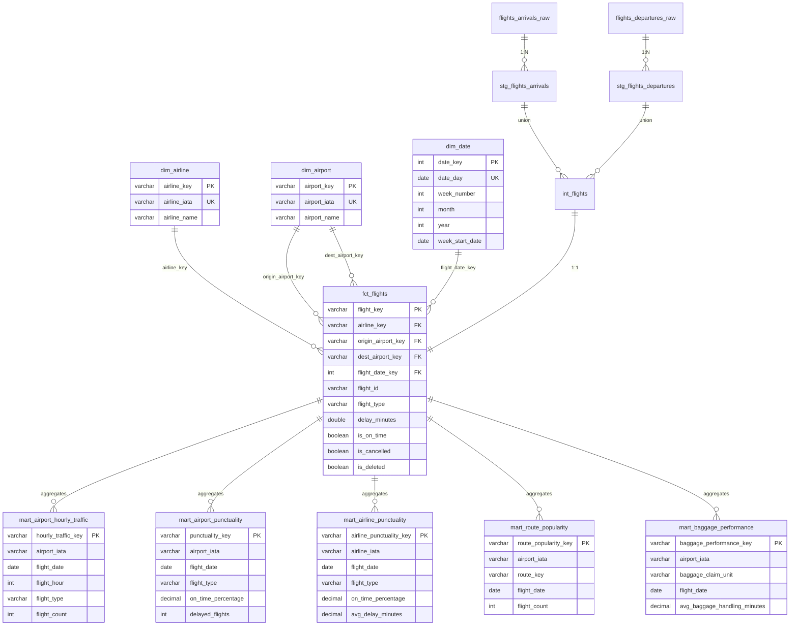

# Swedish Flight Data - Dimensional Model

## Data Model Overview

This dimensional model follows Kimball methodology with a **star schema** design supporting 5 core dashboard requirements:

1. **Airport Traffic Analysis** - How busy airports are (hourly/daily patterns)
2. **Peak Hours Analysis** - Traffic patterns by time of day  
3. **Punctuality & Delays** - On-time performance and delay metrics
4. **Airline Performance Comparison** - Compare airline punctuality and reliability
5. **Route Popularity** - Flight demand by route (directional)

**Bonus**: Baggage handling performance (passenger experience metric)

---

## Entity Relationship Diagram



---

## Data Lineage


---

## Model Layers

### 📥 **Source Layer** (Raw Data)
- `flights_arrivals_raw` - Raw arrivals from Swedavia API (DLT pipeline)
- `flights_departures_raw` - Raw departures from Swedavia API (DLT pipeline)
- **Issue**: Contains duplicate records from multiple API loads

### 🔄 **Staging Layer** (Cleaned & Standardized)
- `stg_flights_arrivals` - Deduplicated arrivals with calculated fields
- `stg_flights_departures` - Deduplicated departures with calculated fields

**Key Transformations:**
- **Deduplication**: `QUALIFY ROW_NUMBER()` by `flight_id` + `scheduled_time_utc`, keeping latest `_dlt_load_id`
- Flatten nested JSON columns
- Rename columns for clarity
- Add calculated fields: `delay_minutes`, `is_on_time`, `is_domestic`
- Add flags: `is_deleted`, `is_cancelled`, `is_landed`
- Time dimensions: `arrival_hour`, `arrival_day_name`, `arrival_time_period`

### 🔀 **Intermediate Layer** (Unified Data)
- `int_flights` - Union of arrivals + departures with `flight_type` discriminator
- Standardizes column names across both flight types

### 📊 **Dimension Layer** (Conformed Dimensions)
- `dim_airline` - Unique airlines with surrogate keys
- `dim_airport` - Swedish airports (10 Swedavia airports)
- `dim_date` - Date dimension with week/month attributes

### 🎯 **Fact Layer** (Atomic Grain)
- `fct_flights` - **Atomic fact table: one row per flight event**
  - Grain: flight_id + flight_type + scheduled_time_utc
  - Foreign keys to all dimensions
  - Measures: delay_minutes, baggage_handling_minutes
  - Degenerate dimensions: terminal, gate, flight_status

### 📈 **Mart Layer** (Dashboard-Ready Aggregates)
- `mart_airport_hourly_traffic` - Traffic patterns by airport/hour
- `mart_airport_punctuality` - Airport delay metrics and on-time %
- `mart_airline_punctuality` - Airline performance comparison
- `mart_route_popularity` - Flight demand by route (directional)
- `mart_baggage_performance` - Baggage handling efficiency

---

## Dashboard Requirements Mapping

| Requirement | Mart Table | Key Metrics | Filters |
|-------------|-----------|-------------|----------|
| **Airport Traffic** | `mart_airport_hourly_traffic` | `flight_count`, hourly patterns | airport, date, flight_type |
| **Peak Hours** | `mart_airport_hourly_traffic` | `flight_count` by `flight_hour`, `flight_time_period` | airport, hour, arrivals/departures |
| **Punctuality** | `mart_airport_punctuality`<br>`mart_airline_punctuality` | `on_time_percentage`, `avg_delay_minutes`, `cancelled_flights` | airport/airline, date, flight_type |
| **Airline Comparison** | `mart_airline_punctuality` | `on_time_percentage`, `delayed_percentage`, `median_delay_minutes` | airline, time period, domestic/international |
| **Route Popularity** | `mart_route_popularity` | `flight_count` by route, `unique_airlines` | airport, route, date |
| **Baggage (Bonus)** | `mart_baggage_performance` | `avg_baggage_handling_minutes`, percentiles | airport, carousel, date |

---

## Data Quality

### Deduplication Strategy

**Problem**: Raw source data contains duplicates (same flight loaded multiple times)

**Solution**: Deduplication at staging layer using:
```sql
QUALIFY ROW_NUMBER() OVER (
    PARTITION BY flight_id, scheduled_arrival_utc 
    ORDER BY _dlt_load_id DESC
) = 1
```
Keeps the most recent version based on DLT load ID.

### Tests Implemented

Tests are defined in schema.yml files (52 total tests, all passing):

**Staging Layer** (`models/staging/schema.yml`):
- `not_null` on `flight_id`, `scheduled_arrival_utc`, `flight_status`
- `accepted_values` on `destination_airport_iata` (Swedish airports)
- `accepted_values` on `flight_status` (SCH, LAN, DEL, CAN, etc.)

**Intermediate Layer** (`models/intermediate/schema.yml`):
- `not_null` on `flight_type`
- `accepted_values` on `flight_type` (arrival, departure)

**Fact Layer** (`models/fct/schema.yml`):
- `unique` + `not_null` on `flight_key` (composite: flight_id + flight_type + scheduled_time_utc)
- `not_null` on all foreign keys (airline_key, origin_airport_key, dest_airport_key, flight_date_key)

**Dimension Layer** (`models/dim/schema.yml`):
- `unique` + `not_null` on all surrogate keys and business keys

**Mart Layer** (`models/mart/schema.yml`):
- `unique` + `not_null` on all mart surrogate keys

Run tests with: `dbt test`

### Business Rules
- Deleted flights (`is_deleted = true`) kept for cancellation analysis
- Delay calculations only for completed flights (`actual_time_utc IS NOT NULL`)
- On-time threshold: ≤ 15 minutes delay (aviation industry standard)
- Domestic routes: Both airports in Swedish airport list (10 Swedavia airports)
